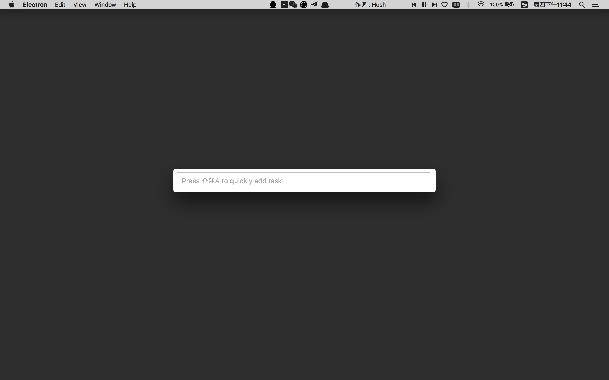

# 滴答清单(TickTick)

> [滴答清单](https://dida365.com/) && [TickTick](https://ticktick.com/) as an app as.

Use Electron to create 滴答清单(TickTick) desktop app.

Easily to add task by shortcut.



## Dev

```
$ npm i && cd app && npm i
```

### Run

```
$ npm start
```

## Build

```
$ npm run build:dida
```
or
```
$ npm run build:tick
```

## License

©MIT
